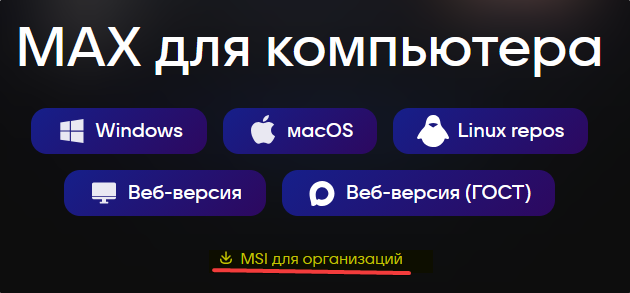

# mah

Исследование, краткое описание сетевого протокола и дампер структур desktop-клиента MAX.

> [!WARNING]
> Проект носит исключительно исследовательский характер. Репозиторий не содержит готовых ботов, библиотек автоматизации или средств обхода защитных механизмов. 
> Использование полученных сведений для взаимодействия с сервисом вне официального интерфейса нарушает [Пользовательское соглашение](https://legal.max.ru/ps) (п. 4.3.7, 4.3.10) и может привести к блокировке учетной записи.

---

## Оглавление

- [mah](#mah)
  - [Оглавление](#оглавление)
  - [Обзор](#обзор)
  - [Быстрый старт](#быстрый-старт)
    - [1. Получение бинарных файлов (MSI / DLL)](#1-получение-бинарных-файлов-msi--dll)
      - [Вариант А: Официальный установщик (Вручную с сайта)](#вариант-а-официальный-установщик-вручную-с-сайта)
      - [Вариант Б: Из установленного клиента](#вариант-б-из-установленного-клиента)
      - [Вариант В: Автоматизация через скрипты репозитория (Опционально)](#вариант-в-автоматизация-через-скрипты-репозитория-опционально)
    - [2. Извлечение конфигурации подключения](#2-извлечение-конфигурации-подключения)
    - [3. Запуск дампера схем](#3-запуск-дампера-схем)
  - [Спецификация сетевого протокола (Wire Format)](#спецификация-сетевого-протокола-wire-format)
    - [Параметры подключения и эндпоинты](#параметры-подключения-и-эндпоинты)
    - [Структура фрейма (Заголовок 10 байт)](#структура-фрейма-заголовок-10-байт)
    - [Сжатие (LZ4) и полезная нагрузка (MessagePack)](#сжатие-lz4-и-полезная-нагрузка-messagepack)
    - [Пример реализации упаковки и распаковки фрейма](#пример-реализации-упаковки-и-распаковки-фрейма)
    - [Модель взаимодействия: RPC и Server-Push](#модель-взаимодействия-rpc-и-server-push)
  - [Под капотом: извлечение структур из MSVC RTTI и .rdata](#под-капотом-извлечение-структур-из-msvc-rtti-и-rdata)
    - [Организация метаданных RTTI в PE32+](#организация-метаданных-rtti-в-pe32)
    - [Построение графа полиморфизма](#построение-графа-полиморфизма)
    - [Паттерн сериализатора в C++ и ассемблерный код MSVC](#паттерн-сериализатора-в-c-и-ассемблерный-код-msvc)
      - [Концептуальный C++ код разработчиков клиента:](#концептуальный-c-код-разработчиков-клиента)
      - [Во что компилятор MSVC превращает конструктор в машинном коде (`.text`):](#во-что-компилятор-msvc-превращает-конструктор-в-машинном-коде-text)
    - [Извлечение полей через iced-x86 и трекинг регистров](#извлечение-полей-через-iced-x86-и-трекинг-регистров)
  - [Формат артефактов и схемы данных](#формат-артефактов-и-схемы-данных)
    - [Структура пакетов (RPC)](#структура-пакетов-rpc)
    - [Структура событий (Server-push)](#структура-событий-server-push)
    - [Полиморфные модели](#полиморфные-модели)
    - [Рекомендации по кодогенерации SDK](#рекомендации-по-кодогенерации-sdk)
  - [Использование dumper\_rust](#использование-dumper_rust)
    - [Сборка и запуск](#сборка-и-запуск)
    - [Параметры CLI](#параметры-cli)
    - [Интеграционное тестирование и переменные окружения](#интеграционное-тестирование-и-переменные-окружения)
  - [Архивные дамперы (IDA Pro / Binary Ninja)](#архивные-дамперы-ida-pro--binary-ninja)
    - [Запуск для исторического аудита и проверки паритета](#запуск-для-исторического-аудита-и-проверки-паритета)

---

## Обзор

Репозиторий документирует бинарный протокол официального desktop-клиента MAX и содержит автономный инструмент на Rust для извлечения схем данных напрямую из нативных библиотек приложения.

Ключевые результаты исследования:
- **Спецификация сетевого транспорта**: бинарный фрейминг, 10-байтный заголовок, сжатие LZ4, MessagePack-сериализация, мультиплексирование потока поверх TLS/TCP.
- **Полная схема протокола (`packets_rust.json`)**: опкоды всех RPC-пакетов, серверные события, вложенные структуры данных и граф полиморфных моделей.
- **Компактное дифференцирование (`packets_rust.compact.txt`)**: нормализованный построчный дамп для отслеживания изменений протокола через `git diff`.
- **Автономный дампер (`dumper_rust`)**: статический анализатор на Rust, извлекающий структуры данных из метаданных MSVC RTTI и машинного кода инициализаторов без сторонних декомпиляторов (~7 секунд для библиотеки `core.dll` размером 25 МБ на стандартном x86-64 CPU).

---

## Быстрый старт

### 1. Получение бинарных файлов (MSI / DLL)

Для работы требуются две библиотеки клиента:
- Конфигурационная библиотека (`config.dll` или `CM_FP_Unspecified.config.dll`) — встроенная конфигурация серверов и API.
- Основная библиотека движка (`core.dll` или `CM_FP_Unspecified.core.dll`) — содержит сетевые пакеты и модели данных.

> [!NOTE]
> Переименовывать библиотеки не требуется: утилиты принимают путь к файлам через параметры командной строки.

Получить их можно любым удобным способом:

#### Вариант А: Официальный установщик (Вручную с сайта)
1. Перейдите на официальную страницу загрузки: [https://download.max.ru/#desktop](https://download.max.ru/#desktop).
2. **Обязательно выберите вариант «MSI для организаций»** (Enterprise). Стандартная кнопка «WINDOWS» может загрузить бандл с яндекс браузером.
3. Откройте скачанный `MAX.msi` через архиватор (например, 7-Zip) и извлеките `CM_FP_Unspecified.config.dll` и `CM_FP_Unspecified.core.dll`.



#### Вариант Б: Из установленного клиента
Если клиент MAX уже установлен в системе, библиотеки можно взять напрямую из каталога установки (по умолчанию `%LocalAppData%\Programs\MAX\`):
- `config.dll`
- `core.dll`

Их можно скопировать в рабочую папку или передать пути к ним в CLI напрямую, без переименования.

#### Вариант В: Автоматизация через скрипты репозитория (Опционально)
Требует наличия утилиты `7z` (7-Zip) в системном `PATH`.

```bash
# Скачивание MSI
./scripts/download_win_max.sh      # Linux / macOS (curl)
# или: powershell -ExecutionPolicy Bypass -File scripts/download_win_max.ps1

# Распаковка MSI через 7z и извлечение DLL в корень репозитория
./scripts/extract_msi.sh          # Linux (msiextract / 7z)
# или: powershell -ExecutionPolicy Bypass -File scripts/extract_msi.ps1
```

---

### 2. Извлечение конфигурации подключения

Скрипт `scripts/config_extractor.py` работает на стандартной библиотеке Python 3.8+ без сторонних зависимостей. Он ищет сбалансированные блоки JSON в бинарных данных конфигурационной библиотеки:

```bash
# Базовый запуск (ищет CM_FP_Unspecified.config.dll в корне):
python scripts/config_extractor.py

# С явным указанием пути к файлу библиотеки и выходному JSON:
python scripts/config_extractor.py path/to/config.dll -o config.json
```

На выходе формируется `config.json` с адресами шлюзов, версией API и тайм-аутами.

---

### 3. Запуск дампера схем

Для сборки дампера требуется установленный компилятор **Rust 1.74+** (Rust 2021 edition):

```bash
# Передайте путь к целевой библиотеке (например, CM_FP_Unspecified.core.dll или core.dll):
cargo run --release -p dumper_rust -- CM_FP_Unspecified.core.dll -o packets_rust.json -c
```

Команда выполнит анализ бинарника и создаст полную схему `packets_rust.json`, а также компактный дамп `packets_rust.compact.txt` для `git diff`.

---

## Спецификация сетевого протокола (Wire Format)

### Параметры подключения и эндпоинты

В десктопном клиенте используется прямое TCP-соединение, защищенное TLS (порт 443). В отличие от веб-версии, работающей поверх WebSocket, desktop-клиент передает бинарные фреймы непосредственно через TLS-сокет.

Параметры считываются из `config.json`:

| Параметр | Ключ в config.json | Значение / Пример | Назначение |
|---|---|---|---|
| **Актуальный хост** | `ssl_url2` | `api2.oneme.ru` | Основной рабочий эндпоинт. Требует доверенного корневого [сертификата Минцифры](https://www.gosuslugi.ru/landing/crt) (в тестовых скриптах строгую валидацию TLS-сертификата можно временно отключить). |
| **Ранний хост** | `ssl_url` | `api.oneme.ru` | Устаревший эндпоинт (может быть отключен или недоступен). |
| **Порт** | `ssl_port` | `443` | Порт TCP/TLS. |
| **Версия протокола** | `api_version_uint` | `11` | Версия протокола (`ver` в заголовке фрейма). На момент написания — `11`. |
| **User-Agent** | `user_agent` | `OneMe Desktop` | Строка идентификатора клиента при рукопожатии. |
| **Интервал Keep-Alive**| `ping_interval` | `30000` | Период отправки клиентом PING-пакетов (в мс). |

---

### Структура фрейма (Заголовок 10 байт)

Каждый пакет в потоке состоит из фиксированного 10-байтного заголовка в формате Big-Endian (Network Byte Order) и следующего за ним тела:

```text
 0                   1                   2                   3
 0 1 2 3 4 5 6 7 8 9 0 1 2 3 4 5 6 7 8 9 0 1 2 3 4 5 6 7 8 9 0 1
+-+-+-+-+-+-+-+-+-+-+-+-+-+-+-+-+-+-+-+-+-+-+-+-+-+-+-+-+-+-+-+-+
|    ver (8)    |           cmd (16)            |    seq (8)    |
+-+-+-+-+-+-+-+-+-+-+-+-+-+-+-+-+-+-+-+-+-+-+-+-+-+-+-+-+-+-+-+-+
|          opcode (16)          |C|        payload_len (24)     |
+-+-+-+-+-+-+-+-+-+-+-+-+-+-+-+-+-+-+-+-+-+-+-+-+-+-+-+-+-+-+-+-+
|                        payload (N bytes)                      |
|                              ...                              |
+-+-+-+-+-+-+-+-+-+-+-+-+-+-+-+-+-+-+-+-+-+-+-+-+-+-+-+-+-+-+-+-+
```

| Поле | Смещение | Размер | Тип | Назначение |
|---|---|---|---|---|
| `ver` | `0x00` | 1 байт | `uint8` | Версия протокола. На момент написания документа — `11` (соответствует `api_version_uint` в `config.json`). |
| `cmd` | `0x01` | 2 байта | `uint16_be` | Команда / флаги. Клиент в запросах всегда передает `0`. В ответах сервер возвращает код состояния (`0` — успех, ненулевые значения — статус/ошибка). |
| `seq` | `0x03` | 1 байт | `uint8` | Порядковый номер пакета (`0..255`). Циклический инкрементный счетчик клиента для сопоставления асинхронного ответа сервера с отправленным запросом. |
| `opcode` | `0x04` | 2 байта | `uint16_be` | Идентификатор операции (RPC-команда или тип серверного события). |
| `packed_len` | `0x06` | 4 байта | `uint32_be` | Составное 32-битное поле: старшие 8 бит содержат флаг компрессии (`comp_flag`), младшие 24 бита содержат длину тела пакета (`payload_len`). |

Битовая раскладка `packed_len`:
```text
 31             24 23                                          0
+-----------------+---------------------------------------------+
|    comp_flag    |            payload_len (24 bits)            |
+-----------------+---------------------------------------------+
```
- `comp_flag` (`packed_len >> 24`):
  - `0` — полезная нагрузка не сжата (raw MessagePack).
  - `2` — тело сжато блочным алгоритмом LZ4 Block (без префикса размера). **Клиент при отправке сжатых пакетов всегда должен выставлять флаг `2`**, иначе сервер разрывает соединение.
  - `1, 3, 4, 5, 6` — могут использоваться сервером во входящих пакетах для обозначения альтернативных режимов LZ4.
- `payload_len` (`packed_len & 0x00FFFFFF`): фактический размер полезной нагрузки в байтах, следующей сразу за заголовком.

---

### Сжатие (LZ4) и полезная нагрузка (MessagePack)

1. **Сериализация**: Полезная нагрузка кодируется в формат [MessagePack](https://msgpack.org/) с включенной поддержкой бинарных строк (`use_bin_type=True`).
2. **Сжатие**: При анализе реального трафика установлено, что порог компрессии составляет **40 байт** (`COMPRESSION_THRESHOLD = 40`). Если сжатый LZ4 Block буфер меньше исходного, клиент использует сжатие и выставляет `comp_flag = 2`.
3. **Распаковка**: Если `comp_flag != 0`, буфер разжимается через `lz4.block.decompress` с достаточным запасом под разжатые данные (до 4–8 МБ), после чего результат десериализуется из MessagePack.

---

### Пример реализации упаковки и распаковки фрейма

Рабочий фрагмент на Python для сериализации и десериализации фреймов:

```python
import struct
import lz4.block
import msgpack

PROTO_VER = 11
PACKET_HEADER_SIZE = 10
PACKET_HEADER_FORMAT = "!BHBHI"  # ver, cmd, seq, opcode, packed_len
PAYLOAD_LEN_BITS = 24
PAYLOAD_LEN_MASK = 0xFFFFFF
COMPRESSION_THRESHOLD = 40
MAX_DECOMPRESSED_SIZE = 4 * 1024 * 1024  # 4 МБ буфер распаковки

def pack_frame(ver: int, seq: int, opcode: int, payload: dict, cmd: int = 0) -> bytes:
    """Сериализует словарь в MessagePack, опционально сжимает LZ4 и упаковывает во фрейм."""
    payload_bytes = msgpack.packb(payload, use_bin_type=True)
    comp_flag = 0

    if len(payload_bytes) > COMPRESSION_THRESHOLD:
        compressed = lz4.block.compress(payload_bytes, store_size=False)
        if len(compressed) < len(payload_bytes):
            payload_bytes = compressed
            comp_flag = 2  # Клиентский флаг LZ4-сжатия

    payload_len = len(payload_bytes) & PAYLOAD_LEN_MASK
    packed_len = (comp_flag << PAYLOAD_LEN_BITS) | payload_len
    header = struct.pack(PACKET_HEADER_FORMAT, ver, cmd, seq & 0xFF, opcode, packed_len)
    return header + payload_bytes

def unpack_frame(data: bytes) -> tuple[int, int, int, int, dict]:
    """Разбирает сетевой пакет из байт потока.
    Возвращает: (ver, cmd, seq, opcode, payload_dict)
    """
    if len(data) < PACKET_HEADER_SIZE:
        raise ValueError("Недостаточно данных для заголовка")

    ver, cmd, seq, opcode, packed_len = struct.unpack(PACKET_HEADER_FORMAT, data[:PACKET_HEADER_SIZE])
    comp_flag = packed_len >> PAYLOAD_LEN_BITS
    payload_len = packed_len & PAYLOAD_LEN_MASK

    if len(data) < PACKET_HEADER_SIZE + payload_len:
        raise ValueError("Тело пакета получено не полностью")

    payload_bytes = data[PACKET_HEADER_SIZE : PACKET_HEADER_SIZE + payload_len]

    if comp_flag != 0:
        payload_bytes = lz4.block.decompress(payload_bytes, uncompressed_size=MAX_DECOMPRESSED_SIZE)

    payload = msgpack.unpackb(payload_bytes, raw=False, strict_map_key=False) if payload_bytes else {}
    return ver, cmd, seq, opcode, payload
```

---

### Модель взаимодействия: RPC и Server-Push

Сетевой поток мультиплексирует два типа пакетов:

```text
Клиент                                                    Сервер
  |                                                          |
  |--- [seq=12, opcode=64] SendMessage Request ------------->|
  |--- [seq=13, opcode=22] GetConfig Request --------------->|
  |                                                          |
  |<-- [seq=12, opcode=64] SendMessage Response -------------| (RPC Response по seq=12)
  |<-- [seq=0,  opcode=128] NotificationMessageData ---------| (Server-push Event по opcode=128)
  |<-- [seq=13, opcode=22] GetConfig Response ---------------| (RPC Response по seq=13)
  |                                                          |
```

1. **RPC (Request-Response)**:
   - Клиент отправляет запрос, увеличивая счетчик `seq = (seq + 1) & 0xFF`.
   - Ответ сервера возвращается с тем же значением `seq`. Клиент сопоставляет ответ с исходным запросом по `seq`.
2. **Server-push События**:
   - Сервер передает асинхронные уведомления (новые сообщения, события чатов) без предшествующего запроса со стороны клиента.
   - Пакеты событий приходят с независимым `seq` (обычно `0`) и маршрутизируются клиентским циклом по значению `opcode`.
3. **Heartbeat / Ping**:
   - По архитектуре протокола именно **клиент обязан периодически отправлять keep-alive пакет `Ping` (`opcode: 1`)** с интервалом `ping_interval` (обычно 30 секунд), предотвращая сброс соединения шлюзом.

---

## Под капотом: извлечение структур из MSVC RTTI и .rdata

Вся информация о пакетах, моделях и типах извлекается из исполняемого файла статически, без эмуляции и без использования декомпиляторов (Hex-Rays, Ghidra, HLIL). Для извлечения структуры полей не требуется восстановление высокоуровневого C-кода — вместо этого используется потоковый декодер инструкций `iced-x86` и конечный автомат отслеживания регистров.

### Организация метаданных RTTI в PE32+

В 64-битных бинарниках MSVC (`x86-64`) указатели в структурах RTTI оптимизированы: вместо абсолютных 64-битных адресов используются **32-битные RVA (Image-Relative Offsets)**:

```text
 Секция .rdata (Константы и метаданные)                     Секция .data (Глобальные)
┌──────────────────────────────────────┐                  ┌───────────────────────────────┐
│ vftable[-1] (64-bit VA на COL)       │─────────────┐    │ TypeDescriptor (struct/class) │
├──────────────────────────────────────┤             │    │  pVFTable (8B)                │
│ vftable[0]  (виртуальный метод 0)    │             │    │  spare    (8B)                │
│ vftable[1]  (виртуальный метод 1)    │             │    │  name[] = ".?AUSendParam..."  │
└──────────────────────────────────────┘             │    └───────────────────────────────┘
                                                     v                   ^
┌────────────────────────────────────────────────────────────┐           │
│ _RTTICompleteObjectLocator (COL)                           │           │
│   signature         = 1 (x64)                              │           │
│   offset            = 0                                    │           │
│   pTypeDescriptor   = RVA на TypeDescriptor в .data ───────┴───────────┘
│   pClassDescriptor  = RVA на _RTTIClassHierarchyDescriptor ────────────┐
│   pSelf             = RVA на этот же COL (самопроверка)    │           │
└────────────────────────────────────────────────────────────┘           │
                                                                         v
                                    ┌─────────────────────────────────────────────────┐
                                    │ _RTTIClassHierarchyDescriptor                   │
                                    │   numBaseClasses = 3                            │
                                    │   pBaseClassArray ───> [_RTTIBaseClassDesc, ...] │
                                    └─────────────────────────────────────────────────┘
```

1. **`TypeDescriptor` в `.data`**: Содержит декорированное имя типа MSVC (префиксы `.?AV` для классов, `.?AU` для структур). Деманглинг имени восстанавливает оригинальные типы C++.
2. **`_RTTICompleteObjectLocator` (COL) в `.rdata`**: Связывает таблицу виртуальных методов с дескриптором типа. Поле `pSelf` содержит собственный RVA структуры, что позволяет надёжно отсеивать ложные совпадения при статическом сканировании:
   $$\text{signature} == 1 \quad \land \quad \text{pSelf} == \text{RVA}_{\text{COL}}$$
3. **Обнаружение таблиц виртуальных методов (`vftable`)**: В структуре MSVC адрес таблицы виртуальных методов предваряется указателем на COL:
   $$\text{VA}(\text{COL}) = *(\text{uint64\_t}*)(\text{VA}(\text{vftable}) - 8)$$
   Сканируя `.rdata` на указатели на COL, дампер строит отображение `vftable_rva <-> C++ Type Name`.

---

### Построение графа полиморфизма

Полиморфизм в протоколе используется для определенных групп сущностей: вложений сообщений (`attachments`), элементов медиа-контекста, параметров событий и системных логов.

Для нахождения всех реализаций базовых интерфейсов дампер считывает бинарные структуры наследования:
1. Для каждого класса через COL считывается дескриптор иерархии `_RTTIClassHierarchyDescriptor`.
2. Поле `pBaseClassArray` указывает на массив RVA записей `_RTTIBaseClassDescriptor`.
3. Анализатор строит ориентированный граф наследования (DAG):
   $$\text{BaseClass} \longrightarrow [\text{DerivedClass}_1, \text{DerivedClass}_2, \dots]$$
4. Все классы, у которых в списке базовых типов обнаружен базовый класс (например, `BaseAttachment`), включаются в список вариантов соответствующей полиморфной модели.

---

### Паттерн сериализатора в C++ и ассемблерный код MSVC

В C++ RTTI содержатся имена классов и граф наследования, но отсутствует информация о полях структур. Однако разработчики клиента используют внутренний шаблонный механизм сериализации: в конструкторе каждой модели поля регистрируются детерминированным образом.

#### Концептуальный C++ код разработчиков клиента:

>[!tip]
> Это примерный псевдокод сериализатора в клиенте, настоящий исходный код может отличаться

```cpp
namespace Api::OneMe::Packets::Messaging::Send {

struct Parameters : public ISerializable {
    int64_t chatId;
    std::string text;
    std::optional<int64_t> replyTo;

    Parameters() {
        // Каждое поле регистрируется связкой:
        // 1. Имя поля ("chatId")
        // 2. Указатель на переменную (&this->chatId)
        // 3. Шаблонный сериализатор SerializableMember<T> (тип T зашит в vftable)
        // 4. Флаг обязательности (1 = required, 2 = optional)
        this->register_field("chatId",  &this->chatId,  /*required=*/1);
        this->register_field("text",    &this->text,    /*required=*/1);
        this->register_field("replyTo", &this->replyTo, /*required=*/2);
    }
};

} // namespace
```

#### Во что компилятор MSVC превращает конструктор в машинном коде (`.text`):

```nasm
; --- Регистрация поля "chatId" (int64_t, required=1) ---
lea  rax, [rip + 0x1348884]        ; Адрес ASCII-строки "chatId" в .rdata
lea  r14, [rip + 0x13494ae]        ; Адрес vftable SerializableMember<int64_t> в .rdata
mov  qword ptr [rdi + 0x58], r14    ; Сохранение vftable сериализатора в структуру
mov  dword ptr [rdi + 0x98], 1      ; Флаг обязательности: 1 = required

; --- Регистрация поля "text" (std::string, required=1) ---
lea  rax, [rip + 0x1348910]        ; Адрес строки "text" в .rdata
lea  r14, [rip + 0x13495f0]        ; Адрес vftable SerializableMember<std::string>
mov  qword ptr [rdi + 0xa0], r14    ; Сохранение vftable
mov  dword ptr [rdi + 0xe0], 1      ; Флаг: 1 = required

; --- Регистрация поля "replyTo" (std::optional<int64_t>, optional=2) ---
lea  rax, [rip + 0x1348990]        ; Адрес строки "replyTo"
lea  r14, [rip + 0x1349720]        ; Адрес vftable SerializableMember<std::optional<int64_t>>
mov  qword ptr [rdi + 0xe8], r14    ; Сохранение vftable
mov  dword ptr [rdi + 0x128], 2     ; Флаг: 2 = optional
```

---

### Извлечение полей через iced-x86 и трекинг регистров

Так как сгенерированный ассемблерный шаблон строго детерминирован, дамперу не требуется декомпилировать машинный код в C++:

- Сначала дампер находит в `.rdata` сигнатуры `CommonPacket<Opcode, Req, Resp>` (опкоды и имена типов), связывает их с адресом `vftable` и переходит к конструктору в `.text`. Границы функции считываются без эвристик из каталога исключений PE32+ (`.pdata` / `RUNTIME_FUNCTION`).
- Затем декодер `iced-x86` последовательно разбирает инструкции функции. Поскольку компилятор может переиспользовать регистры (например, для серии строк инструкция `lea` выполняется однократно), дампер эмулирует состояние 16 регистров общего назначения: отслеживает, где находится строковый литерал имени, а где — `vftable` мембера `SerializableMember<T>`.
- При обнаружении записи флага обязательности (`mov [rdi + ...], 1` или `2`) либо при переходе к следующему полю дампер фиксирует готовое поле модели (имя, тип `T`, статус `required`).

Полная реализация логики трекинга регистров и извлечения полей приведена в [`dumper_rust/src/extractor.rs`](dumper_rust/src/extractor.rs).

---

## Формат артефактов и схемы данных

Дампер генерирует два взаимодополняющих файла схем:
- **`packets_rust.json`**: Полный машиночитаемый JSON-документ со всеми метаданными, флагами опциональности, типами данных, смещениями и полиморфными связями.
- **`packets_rust.compact.txt`**: Компактное построчное текстовое представление протокола (опкоды, имена пакетов, поля и типы). Файл оптимизирован для быстрого анализа изменений при обновлениях клиента: в отличие от многотысячестрочного JSON, он дает чистый и наглядный `git diff`, позволяя мгновенно увидеть добавленные, удаленные или измененные поля и опкоды.

---

### Структура пакетов (RPC)

Каждый элемент массива `packets` описывает двунаправленный RPC-вызов:

```json
{
  "opcode": 64,
  "name": "Api::OneMe::Packets::Messaging::Send",
  "direction": "bidirectional",
  "handler": "Api::OneMe::Packets::Messaging::Send::Handler",
  "model": "Api::OneMe::Packets::Messaging::Send::Parameters",
  "request": {
    "name": "Api::OneMe::Packets::Messaging::Send::Parameters",
    "offset": "0x3f46c0",
    "fields": [
      {
        "name": "chatId",
        "type": { "full": "int64_t", "name": "int64_t", "optional": false, "array": false, "map": false },
        "required": true
      },
      {
        "name": "message",
        "type": { "full": "Api::OneMe::Types::OutgoingMessage", "name": "Api::OneMe::Types::OutgoingMessage", "optional": false, "array": false, "map": false },
        "required": true
      }
    ]
  },
  "response": {
    "name": "Api::OneMe::Packets::Messaging::Send::Response",
    "offset": "0x3f4af0",
    "fields": [
      {
        "name": "chatId",
        "type": { "full": "int64_t", "name": "int64_t", "optional": false, "array": false, "map": false },
        "required": true
      },
      {
        "name": "message",
        "type": { "full": "Api::OneMe::Types::Message", "name": "Api::OneMe::Types::Message", "optional": false, "array": false, "map": false },
        "required": true
      }
    ]
  }
}
```

---

### Структура событий (Server-push)

Элементы массива `events` описывают асинхронные уведомления сервера. Например, событие `opcode: 128` (`NotificationMessageData`):

```json
{
  "opcode": 128,
  "request": {
    "name": "Api::OneMe::Packets::Events::NotificationMessageData::Parameters",
    "offset": "0xc93230",
    "fields": [
      {
        "name": "chatId",
        "type": { "full": "int64_t", "name": "int64_t", "optional": false, "array": false, "map": false },
        "required": true
      },
      {
        "name": "messageId",
        "type": { "full": "int64_t", "name": "int64_t", "optional": false, "array": false, "map": false },
        "required": true
      }
    ]
  },
  "response": {
    "name": "Api::OneMe::Packets::Events::NotificationMessageData::Payload",
    "offset": "0xc93600",
    "fields": [
      {
        "name": "chatId",
        "type": { "full": "int64_t", "name": "int64_t", "optional": false, "array": false, "map": false },
        "required": true
      }
    ]
  }
}
```

---

### Полиморфные модели

Массив `polymorphic_models` содержит иерархии полиморфных моделей (вложения `BaseAttachment`, элементы сообщений, контексты):

```json
{
  "name": "Api::OneMe::Types::BaseAttachment",
  "discriminator": {
    "field": "_type",
    "type": "std::string"
  },
  "base": {
    "fields": [
      { "name": "_type", "type": { "name": "std::string", "optional": false }, "required": true },
      { "name": "deleted", "type": { "name": "bool", "optional": true }, "required": false }
    ]
  },
  "variants": [
    {
      "name": "Api::OneMe::Types::ContactAttachment",
      "tag": "CONTACT",
      "fields": [
        { "name": "contactId", "type": { "name": "int64_t", "optional": true }, "required": true },
        { "name": "firstName", "type": { "name": "std::string", "optional": false }, "required": false }
      ],
      "all_fields": [
        { "name": "_type", "type": { "name": "std::string", "optional": false }, "required": true },
        { "name": "deleted", "type": { "name": "bool", "optional": true }, "required": false },
        { "name": "contactId", "type": { "name": "int64_t", "optional": true }, "required": true },
        { "name": "firstName", "type": { "name": "std::string", "optional": false }, "required": false }
      ]
    }
  ]
}
```

- **`discriminator`**: Поле `_type` в сообщении указывает, в какой производный класс десериализовать объект.
- **`tag`**: Строковое значение поля `_type` (например, `"CONTACT"`, `"PHOTO"`), идентифицирующее конкретный вариант.
- **`all_fields`**: Полный плоский список полей для сериализатора (наследуемые базовые поля + специфичные поля варианта).

---

### Рекомендации по кодогенерации SDK

- **Открытые схемы данных**: объявляйте модели толерантными к дополнительным полям (`total=False` в Python `TypedDict`, опциональные свойства в TypeScript, теги `omitempty` в Go). Сервер может расширять payload новыми полями без инкремента версии RPC.
- **Обработка nullable-полей**: поля с флагом `"optional": true` могут либо отсутствовать в словаре MessagePack, либо приходить со значением `nil`. В коде SDK их следует типизировать как `Optional[T]` / `T | null`.
- **Маршрутизация полиморфных моделей**: целевой вариант вложения или события определяется строковым дискриминатором `_type`, сопоставляемым со значением `tag` конкретной структуры.
- **64-битные идентификаторы**: поля `chatId` и `messageId` передаются как знаковые 64-битные целые (`int64_t`). В средах без встроенной поддержки 64-битных чисел (например, JavaScript / V8) их необходимо десериализовать в `BigInt` во избежание потери точности.

---

## Использование dumper_rust

### Сборка и запуск

```bash
# Сборка оптимизированного бинарника
cargo build --release -p dumper_rust

# Запуск дампера с генерацией полного и компактного дампов
cargo run --release -p dumper_rust -- CM_FP_Unspecified.core.dll -o packets_rust.json -c
```

### Параметры CLI

```text
Использование: dumper_rust [ОПЦИИ] <TARGET>

Аргументы:
  <TARGET>                               Путь к исследуемому бинарному файлу core.dll

Опции:
  -o, --output <OUTPUT>                  Путь для сохранения JSON-схемы [по умолчанию: packets_rust.json]
  -c, --compact-output [<COMPACT>]       Путь для сохранения компактного текстового дампа [по умолчанию: packets_rust.compact.txt]
      --diagnostics-output <PATH>        Путь для сохранения диагностического файла метаданных
      --app-version <VERSION>            Ручное переопределение версии клиента (по умолчанию извлекается из бинарника)
      --build-number <NUMBER>            Ручное переопределение номера сборки (по умолчанию извлекается из бинарника)
  -h, --help                             Вывод справочной информации
```

### Интеграционное тестирование и переменные окружения

Запуск модульных тестов не требует наличия исходных DLL:
```bash
cargo test -p dumper_rust
```

Интеграционные тесты проверяют сквозной анализ, SLA по времени выполнения и паритет схем с эталонными дампами. Они активируются через переменные окружения:

- `CORE_DLL_PATH`: Путь к файлу `CM_FP_Unspecified.core.dll`. Активирует сквозное тестирование дампера (проверка инвариантов по количеству пакетов, событий и полиморфных корней).
- `BINJA_DUMP_PATH`: Путь к эталонному дампу Binary Ninja (`packets_binja.json`) для проверки паритета моделей.
- `RUST_DUMP_PATH`: Путь к дампу `packets_rust.json` для проверки структуры JSON.
- `RUST_COMPACT_DUMP_PATH`: Путь к `packets_rust.compact.txt` для проверки детерминированности форматирования.

Пример запуска интеграционного тестирования в PowerShell:
```powershell
$env:CORE_DLL_PATH = "path\to\CM_FP_Unspecified.core.dll"
$env:BINJA_DUMP_PATH = "path\to\mah\packets_binja.json"
cargo test -p dumper_rust
```

---

## Архивные дамперы (IDA Pro / Binary Ninja)

Скрипты в директориях `dumper_ida_legacy/` и `dumper_binja_legacy/` создавались на раннем этапе исследования как **Proof of Concept (PoC)** для проверки принципиальной возможности извлечения структур через API декомпиляторов.

В настоящее время они переведены в статус **архивных** (`Archived & Unsupported`):
- **Хрупкость эвристик**: парсинг псевдокода Hex-Rays и текстовых дампов нестабилен и ломается при любых изменениях версии компилятора или уровней оптимизации.
- **Ограничения лицензий и CI/CD**: работа через декомпиляторы требует коммерческих лицензий с поддержкой Python API и графической подсистемы, что исключает их использование в автоматических контейнерных пайплайнах. 

### Запуск для исторического аудита и проверки паритета

- **IDA Pro**: Открыть `CM_FP_Unspecified.core.dll`, дождаться окончания анализа, вызвать `File -> Script File...` и выбрать `dumper_ida_legacy/run.py`. Результат сохраняется в `packets.json`.
- **Binary Ninja**: Открыть `CM_FP_Unspecified.core.dll` в версии Personal+, дождаться завершения анализа, открыть консоль Python и запустить `dumper_binja_legacy/run.py`. Результат сохраняется в `packets_binja.json`.
