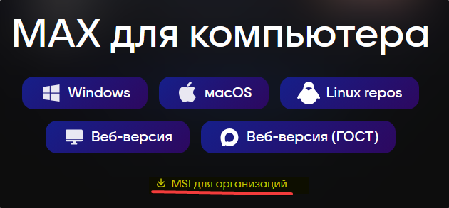
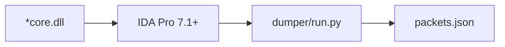
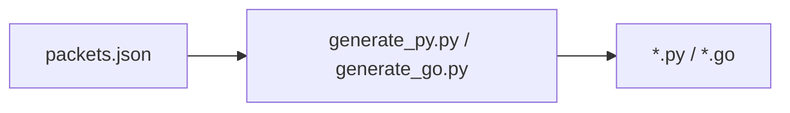
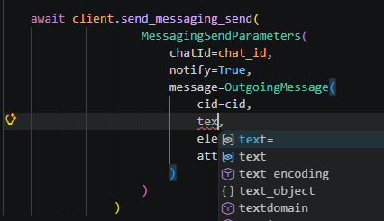
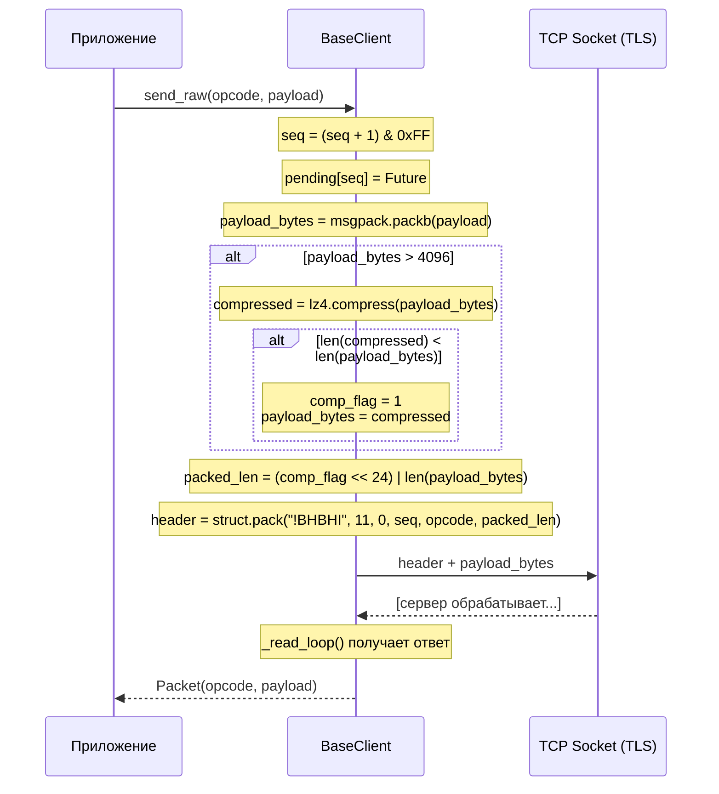
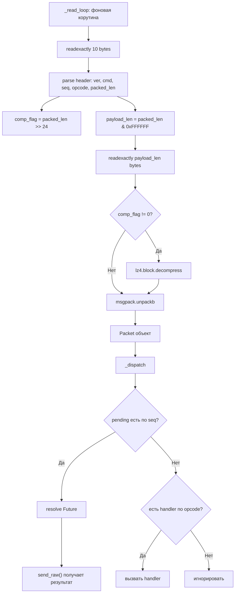

# DEVEL

## Оглавление:

- [Дамп моделей](#дамп-моделей)
- [Кодогенерация из дампа](#кодогенерация-из-дампа)
- [Как с этим работать?](#как-с-этим-работать)
- [Транспорт](#транспорт)

## Дамп моделей

dumper/ - скрипт для IDA pro 7.1+ для дампа структур пакетов для последующей генерации SDK. требуется hex-rays декомпилятор, на free версии не будет работать.

Извлечение:
* скачать windows client https://download.max.ru/#desktop

>[!node]
> (24.05.2026) если будете вручную скачивать установочный файл нажимайте "MSI для организаций".
> в кнопке "WINDOWS" при определенных условиях может начать скачивать `MAX+Yandex.msi` с яндекс браузером. 
> Его нежелательно использовать так как добавляет еще одно необязательное поле для подключения (будет ниже обзор пакетов)




или воспользуйтесь скриптами:

Windows:

```powershell
powershell -ExecutionPolicy Bypass -File .\download_win_max.ps1`
```
*Unix

```shell
chmod +x download_win_max.sh
./download_win_max.sh
```

* Вы можете установить мессенджер и вручную найти `core.dll` файл или воспользуйтесь скриптами для его извлечения:

Нужно положить установочник `MAX.msi` в каталог. Требуется установленный архиватор 7zip в системе с доступом к команде `7z`:

Windows:

```powershell
powershell -ExecutionPolicy Bypass -File .\extract_msi.ps1
```

с задаванием параметров:

```powershell
powershell -ExecutionPolicy Bypass -File .\extract_msi.ps1 `
    -Msi "C:\temp\MAX(3).msi" `
    -Out "C:\temp\unpack"
```

*Unix:

дать доступ на выполнение:

```shell
chmod +x extract_msi.sh
```

запустить:

```shell
./extract_msi.sh
```

с кастомными параметрами:

```shell
./extract_msi.sh "/path/to/file.msi" "/tmp/unpack"
```

1. загрузить dll в ida-pro
2. подождать полное сканирование проекта (в левом нижнем углу должен быть label `AU: idle | Down` )
3. загрузить скрипт (File -> Script File...) dumper/run.py, ждать когда сохранит дамп 
4. дамп сохранится в директории откуда загружали dll в IDA-PRO, не в папке со скриптом

### Пайплайн дампа



### Структура дампера

| Файл                        | Назначение                                                      |
| --------------------------- | --------------------------------------------------------------- |
| `dumper/run.py`             | Точка входа, загрузка и запуск анализатора                      |
| `dumper/analyzer.py`        | Оркестрация: сбор пакетов, анализ типов, сохранение JSON        |
| `dumper/field_extractor.py` | Извлечение полей структур (hex-rays + fallback на дизассемблер) |
| `dumper/common.py`          | Общие утилиты                                                   |
| `dumper/ida_utils.py`       | IDA-специфичные хелперы                                         |
| `dumper/symbol_index.py`    | Индексация символов                                             |
| `dumper/template_parser.py` | Парсинг шаблонов типов                                          |

### Overview дампа

```
{
  "image_base": "0x180000000",  // базовый адрес, для отладки в дизассемблере
  "app_version": str, //  версия билда клиента
  "build_number": int, // номер сборки
  "rpc_ver": 11,  // версия RPC протокола
  "packets": [...],  // дамп request/response пакетов
  "models": { ... }, // вложенные типы объектов
  "polymorphic_models": { ... },  // наследуемые типы
  "opcodes": [int, ...],  // все найденные опкоды в дампах. Чтобы в кодовой базе не создавать "магические" числа
  "string_enums": [str, ...] // все найденные строковые константы, которые используются в payload. Чтобы не плодить "магические" строковые константы
}
```

Пример пакета:

```
    {
      "opcode": 64,  // номер опкода команды
      "request": {   // объект для запроса (ориентироваться на этот payload)
        "full_name": "Api::OneMe::Packets::Messaging::Send::Parameters",  // найденная структура
        "kind": "Parameters",
        "name_method": "hexrays",
        "offset": "0x3f46c0",  // оффсет для отладки в декомпиляторе из снятого клиента
        "fields": [  // поля payload структуры
          {
            "name": "chatId",  // имя ключа
            "type": "std::optional<__int64>",  // определенный c++ тип данных декомпилятором
            "required": true  // обязательный параметр (эвристическая метка)
          },
          {
            "name": "postId",
            "type": "std::optional<__int64>",
            "required": true
          },
          {
            "name": "userId",
            "type": "std::optional<__int64>",
            "required": true
          },
          {
            "name": "notify",
            "type": "std::optional<bool>",
            "required": true
          },
          {
            "name": "message",
            "type": "Api::OneMe::Types::OutgoingMessage", // вложенный тип, искать его в "models"
            "required": true
          },
          {
            "name": "lastKnownDraftTime",
            "type": "std::optional<__int64>",
            "required": true
          }
        ],
        "warn": null  // используется для записи если не все типы определились
      },
      "response": {  // структура ответа
        "full_name": "Api::OneMe::Packets::Messaging::Send::Response",
        "kind": "Response",
        "name_method": "hexrays",
        "offset": "0x3f4af0",
        "fields": [
          {
            "name": "chatId",
            "type": "__int64",
            "required": true
          },
          {
            "name": "postId",
            "type": "std::optional<__int64>",
            "required": true
          },
          {
            "name": "message",
            "type": "Api::OneMe::Types::Message",
            "required": true
          },
          {
            "name": "chat",
            "type": "std::optional<Api::OneMe::Types::Chat>",
            "required": true
          },
          {
            "name": "unread",
            "type": "std::optional<int>",
            "required": true
          },
          {
            "name": "mark",
            "type": "std::optional<__int64>",
            "required": true
          }
        ],
        "warn": null
      }
    },
```

пример модели:

```
{
  "Api::OneMe::Types::OutgoingMessage": {  // имя определенной структуры-модели
      "fields": [
        {
          "name": "cid",
          "type": "std::optional<__int64>",
          "required": true
        },
        {
          "name": "text",
          "type": "std::optional<std::string>",
          "required": true
        },
        {
          "name": "zoom",
          "type": "std::optional<int>",
          "required": false
        },
        {
          "name": "attaches",
          "type": "std::optional<std::vector<Api::OneMe::Types::Polymorphic<Api::OneMe::Types::Outgoing::BaseAttachment,Api::OneMe::Types::Outgoing::BaseAttachment>>>",
          "required": true
        },
        {
          "name": "link",
          "type": "std::optional<Api::OneMe::Types::OutgoingMessage::OutgoingMessageLink>",
          "required": true
        },
        {
          "name": "attachMEL",
          "type": "std::optional<bool>",
          "required": true
        },
        // ошибка декомпилятора, реальный тип bool
        // ниже будет инструкция как исправить
        {
          "name": "ttl",
          "type": "std::optional<int>",
          "required": true
        },
        {
          "name": "isLive",
          "type": "std::optional<bool>",
          "required": true
        },
        {
          "name": "elements",
          "type": "std::optional<std::vector<Api::OneMe::Types::MessageElement>>",
          "required": true
        },
        {
          "name": "delayedAttributes",
          "type": "std::optional<Api::OneMe::Types::DelayedTamAttributes>",
          "required": true
        }
      ],
      "name_method": "hexrays",
      "offset": "0x87a6d0",
      "warn": null
    }
}
```

пример полиморфной модели вложений (наследуемые типы от базового):

```json
{
  "Api::OneMe::Types::BaseAttachment": {
    "variants": {
      "Api::OneMe::Types::ContactAttachment": {
        "fields": [
          { "name": "_type", "type": "std::string", "required": true },
          { "name": "deleted", "type": "std::optional<bool>", "required": true },
          { "name": "contactId", "type": "std::optional<__int64>", "required": true },
          { "name": "firstName", "type": "std::string", "required": false },
          { "name": "lastName", "type": "std::optional<std::string>", "required": false },
          { "name": "vcfBody", "type": "std::optional<std::string>", "required": true }
        ]
      },
      "Api::OneMe::Types::AudioAttachment": {
        "fields": [
          { "name": "_type", "type": "std::string", "required": true },
          { "name": "deleted", "type": "std::optional<bool>", "required": true },
          { "name": "audioId", "type": "__int64", "required": true },
          { "name": "url", "type": "std::optional<std::string>", "required": false },
          { "name": "duration", "type": "int", "required": true }
        ]
      }
    }
  }
}
```

## Кодогенерация из дампа

Примеры скриптов на python генерируют готовый шаблонный код в соответствии описанию структур с трансформацией c++ типов в его аналог:



Пример запуска генератора (из папки проекта):

```
python generate_py.py packets.json python_max_tcp/
```

### Советы по дизайну кодогенератора

>[!tip]
>
> Этот раздел для тех, кто хочет через LLM по принципу vibecode максимально быстро реализовать кодогенератор. Финального кода выйдет <2000 строк кода. Подойдут режим чата из браузера+copy-paste или "бюджетные" модели как deepseek, qwen для такой задачи.
>
> Если вам идеология не позволяет генерировать слоп или вы знаете как сделать лучше - пропускайте написанное.

Для реализации рекомендуется использовать простые, мейнстримные, динамические скриптовые ЯП. Компилируемые ЯП подойдут, **если есть динамические списки для строк**, но не рекомендуются, они могут быть избыточны для этой задачи для нечастой генерации кода. 
Прикладывайте минимальный образец дампов и все cpp типы которые применяются.
Транспорт можно отдельно сгенерировать - его практически не нужно изменять, нужно только добавлять shortcut методы для удобства вызова.

>[!tip] Эмпирическое наблюдение
>
> Чтобы **MAX**сиамально упростить создание кодогенератора через LLM, рекомендуется не тащить шаблонизаторы или конкатенировать строки: собирайте все куски строк в динамический лист и затем объединяйте в конце. Да это не самый эффективный и элегантный подход, но это стабильный способ с минимумом галлюцинаций для ваибкод победы!


```python
# не рекомендуется, LLM может запутаться:
result = "def foo():"
result += "\n    x = "
result += str(42)  # <-- здесь модель "видит" незавершённый паттерн

# отлично, LLM не путается в контексте, стабильно генерирует
# семантически модель "понимает" завершение конструкций фрагментов
parts = []
parts.append("def foo():")
parts.append("    return 42")
result = "".join(parts)  # LLM видит чёткую границу закрытия операции

# тоже норм, меньше цепочек вызовов, приятнее читать, LLM vibecode friendly
code = []
code.extend([
  "def foo():",
  "    return " + str(42),
])
result = "\n".join(code)
```

Даже если "глаза вытекают" от такой реализации и очень руки чешутся что-то типа такого вынести в константу - максимум выводите такие блоки кода в отдельные вспомогательные методы или функции, выносить в константы не рекомендуется.

```python
# ужас, хочется в константу вынести это полотно!
code.extend([
            "// Client is the main API client.",
            "type Client struct {",
            "  AppVersion string",
            "  VerboseLog bool",
            "  conn       net.Conn",
            "  wsConn     *websocket.Conn",
            "  useWS      bool",
            "  seq        uint8",
            "  mu         sync.Mutex",
            "  pending    map[uint8]chan *Packet",
            "  handlers   map[uint16][]func(*Packet)",
            "  closeCh    chan struct{}",
            "}",
            "",
        ])
```


### Замечания по финальным моделям

* так как это неофициальный API, базирующийся на дампе, **100% стабильность и полнота структур не гарантируется**. Чтобы код неожиданно не падал в runtime, в архитектуру закладывайте следующие условия
  * для статик ЯП закладывайте safe геттеры и допускайте ситуации, что payload пакета может отличаться от сгенерированного: разработчики могут добавлять новые поля или убрать старые. Например, это явно видно явно на модели для настроек `Api::OneMe::Types::UserSettings` и на response `"opcode": 22, "Api::OneMe::Packets::Config"`
  * Может понадобиться делать патчи в файле `dev/dumper/PATCHES.py`, чтобы тип данных совпадал с реальным.
    * Например, в ["models"]["Api::OneMe::Types::Message"] дизассемблер определил поле `ttl` как `std::optional<int>`, но в реальности он bool:

  ```json
  "Api::OneMe::Types::Message": {
      "fields": [
        // ...
        {
          "name": "attaches",
          "type": "std::optional<std::vector<Api::OneMe::Types::Polymorphic<Api::OneMe::Types::BaseAttachment,Api::OneMe::Types::BaseAttachment>>>",
          "required": true
        },
        {
          "name": "link",
          "type": "std::optional<std::shared_ptr<Api::OneMe::Types::MessageLink>>",
          "required": true
        },
        // ОШИБКА! Ральный тип этого поля - bool, а не int
        {
          "name": "ttl",
          "type": "std::optional<int>",
          "required": true
        },
        // ...
      ],
    },

  ```

  * для динамических ЯП не рекомендуется сериализовывать payload объекты в жесткие структуры (например python dataclasses, pydantic). Используйте хеш-таблицы с аннотациями.
    * для python это [typing.TypedDict](https://docs.python.org/3/library/typing.html#typing.TypedDict) с параметром `total=False`.
    * для javascript - [jsdoc](https://jsdoc.app/)


### Как с этим работать?

>[!tip]
> Код надо сгенерировать. Генератором. Я его дам. Как этим пользоваться нужна документация. Документацию я не дам.

Её не существует в природе, надо проводить обратную разработку, смотреть траффик реальных приложений: в  мобильном приложении или его ближайшем аналоге - веб версии. Сгенерированные модели помогут в автокомплите - описывать модели руками не нужно!


Пример автокомплита реализации отправки сообщения

В демонстрационных SDK показана минимальная демонстрация авторизации и применения методов.

## Транспорт

> [!note]
> WebSocket клиент может отличаться от десктопного TCP-клиента. В этом документе рассматривается **только TCP** реализация. WebSocket похож по моделям, но могут быть различия.

### Формат TCP-пакета

Каждый пакет — это 10-байтный заголовок (big-endian) + тело:

```
┌──────────┬──────────┬──────────┬──────────┬───────────────────┐
│  ver (1) │ cmd (2)  │ seq (1)  │opcode(2) │  packed_len (4)   │
└──────────┴──────────┴──────────┴──────────┴───────────────────┘
┌───────────────────────────────────────────────────────────────┐
│                     payload (N bytes)                         │
└───────────────────────────────────────────────────────────────┘
```

| Поле         | Размер  | Описание                                                                                                                  |
| ------------ | ------- | ------------------------------------------------------------------------------------------------------------------------- |
| `ver`        | 1 byte  | Версия протокола (11)                                                                                                     |
| `cmd`        | 2 bytes | Тип: клиент всегда шлёт `0`, сервер отвечает значением от 0-256 (не исследовано поведение)                                |
| `seq`        | 1 byte  | Порядковый номер запроса (0–255, циклический). Сервер отвечает тем же seq (на практике может быть 2bytes, не исследовано) |
| `opcode`     | 2 bytes | Номер команды (определяет, что именно запрашиваем/получаем)                                                               |
| `packed_len` | 4 bytes | **Старший байт** — флаг lz4-сжатия (`0` или `1`), **младшие 3 байта** — длина payload                                     |

struct: `!BHBHI` (network byte order / big-endian)

### Payload

Раздел основан на наработках https://github.com/nyakokitsu/MaxProtoExplanation/, здесь его краткая выжимка с диаграммами.

- **Сериализация**: [msgpack](https://msgpack.org/)
- **Сжатие**: если payload после msgpack > 4096 байт и lz4-сжатие даёт выгоду — сжимается через `lz4.block` (raw block, без сохранения оригинального размера в заголовке lz4)
- При получении: если `comp_flag == 1` — сначала lz4 decompress, затем msgpack unpack

#### Как отправить пакет



**Кратко:**
1. Сериализуем payload через msgpack
2. Если результат > 4 KB — пытаемся сжать lz4, ставим флаг сжатия
3. Собираем 10-байтный заголовок с `cmd=0`, текущим `seq` и нужным `opcode`
4. Отправляем `header + payload` в TCP-сокет
5. Сохраняем `seq → Future` в словарь pending-запросов
6. Ждём, пока фоновый read loop не сопоставит ответ по seq и не зарезолвит Future

#### Как принять пакет

>[!warning]
> В PoC реализации используется максимальный размер в 0xFFFFFF. Не исследовано какого максимального размера может быть реальный пакет. Учитывайте это, чтобы оптимизировать потребление памяти!



**Кратко:**
1. Фоновая корутина `_read_loop()` вечно читает из сокета
   1. Чтобы не оборвалось соединение: как оригинальный клиент, присылайте каждые 30 секунд команду PING (opcode=1) и читайте
2. Сначала reads exactly 10 байт — заголовок
3. Извлекает длину payload (маскируем флаг сжатия)
4. Читает ровно столько байт тела
5. Если стоит флаг сжатия — lz4 decompress
6. msgpack unpack → получаем `Packet`
7. `_dispatch()` ищет pending Future по `seq` — если нашёл, резолвит (это ответ на наш запрос)
8. Также вызывает зарегистрированные handlers по `opcode` (это серверные пуши/нотификации)

### Seq — корреляция запрос-ответ

`seq` — это 1-байтный счётчик (0–255, wrap around, (может быть больше, не исследовано)). Он единственный способ понять, какой ответ к какому запросу относится:

```
Клиент шлёт:     seq=5  opcode=64   → "отправить сообщение"
Сервер отвечает:  seq=5  opcode=64   → "сообщение отправлено, вот result"

Клиент шлёт:     seq=6  opcode=22   → "получить конфиг"
                  seq=7  opcode=64   → "отправить ещё"
Сервер отвечает:  seq=7  opcode=64   → "вот ответ на второй запрос"
                  seq=6  opcode=22   → "вот конфиг" (может прийти в любом порядке!)
```

### Пример

Минимальный псевдокод отправки и приёма TCP-пакетов:

```python
import struct
import ssl
import socket
import msgpack
import lz4.block
import threading
import time

PROTO_VER = 11
# наугад выявлено значение когда нужно паковать в lz4. Может быть вообще не нужно для отправки?
COMPRESS_THRESHOLD = 4096


def pack_packet(seq, opcode, payload):
    """Собрать TCP-пакет: msgpack → lz4 → header + body."""
    payload_bytes = msgpack.packb(payload, use_bin_type=True)

    comp_flag = 0
    if len(payload_bytes) > COMPRESS_THRESHOLD:
        compressed = lz4.block.compress(payload_bytes, store_size=False)
        if len(compressed) < len(payload_bytes):
            payload_bytes = compressed
            comp_flag = 1

    packed_len = (comp_flag << 24) | (len(payload_bytes) & 0xFFFFFF)
    header = struct.pack("!BHBHI", PROTO_VER, 0, seq, opcode, packed_len)
    return header + payload_bytes


def read_exact(sock, n):
    """Прочитать ровно n байт из сокета."""
    buf = b""
    while len(buf) < n:
        chunk = sock.recv(n - len(buf))
        if not chunk:
            raise ConnectionError("socket closed")
        buf += chunk
    return buf


def unpack_packet(data):
    """Распарсить TCP-пакет: header → body → lz4 → msgpack."""
    ver, cmd, seq, opcode, packed_len = struct.unpack("!BHBHI", data[:10])
    comp_flag = packed_len >> 24
    # нужно эвристически выявлять реальный максимальный размер.
    # в production может привести к DOS и утечкам памяти!
    payload_len = packed_len & 0xFFFFFF
    payload_bytes = data[10 : 10 + payload_len]

    if comp_flag != 0:
        payload_bytes = lz4.block.decompress(payload_bytes, uncompressed_size=8 * 1024 * 1024)

    payload = msgpack.unpackb(payload_bytes, raw=False) if payload_bytes else None
    return {"ver": ver, "cmd": cmd, "seq": seq, "opcode": opcode, "payload": payload}


def read_loop(sock, pending, on_notification):
    """Фоновый цикл чтения: читает пакеты и диспетчеризирует."""
    while True:
        try:
            header = read_exact(sock, 10)
            _, _, _, _, packed_len = struct.unpack("!BHBHI", header)
            payload_len = packed_len & 0xFFFFFF
            body = read_exact(sock, payload_len)
            pkt = unpack_packet(header + body)
        except Exception:
            break

        # Ответ на наш запрос — сопоставляем по seq
        future = pending.pop(pkt["seq"], None)
        if future is not None:
            future["result"] = pkt
            future["event"].set()
        else:
            # Серверный пуш — вызываем handler
            on_notification(pkt)


def request(sock, seq_counter, pending, opcode, payload, timeout=30):
    """Отправить запрос и дождаться ответа по seq."""
    seq = seq_counter[0]
    seq_counter[0] = (seq + 1) & 0xFF

    future = {"result": None, "event": threading.Event()}
    pending[seq] = future

    sock.sendall(pack_packet(seq, opcode, payload))

    if not future["event"].wait(timeout):
        pending.pop(seq, None)
        raise TimeoutError(f"opcode={opcode} seq={seq}")
    return future["result"]


# --- Использование ---

ctx = ssl.create_default_context()
raw_sock = socket.create_connection(("api.oneme.ru", 443))
sock = ctx.wrap_socket(raw_sock, server_hostname="api.oneme.ru")

pending = {}
seq_counter = [0]

# Запускаем фоновое чтение
threading.Thread(target=read_loop, args=(sock, pending, print), daemon=True).start()

# Отправляем запрос
resp = request(sock, seq_counter, pending, opcode=64, payload={"chatId": 123})
print(f"ответ: {resp}")

# PING каждые 30 секунд, чтобы сервер не закрыл соединение
def ping_loop():
    while True:
        time.sleep(30)
        request(sock, seq_counter, pending, opcode=1, payload={"interactive": False})

threading.Thread(target=ping_loop, daemon=True).start()
```
